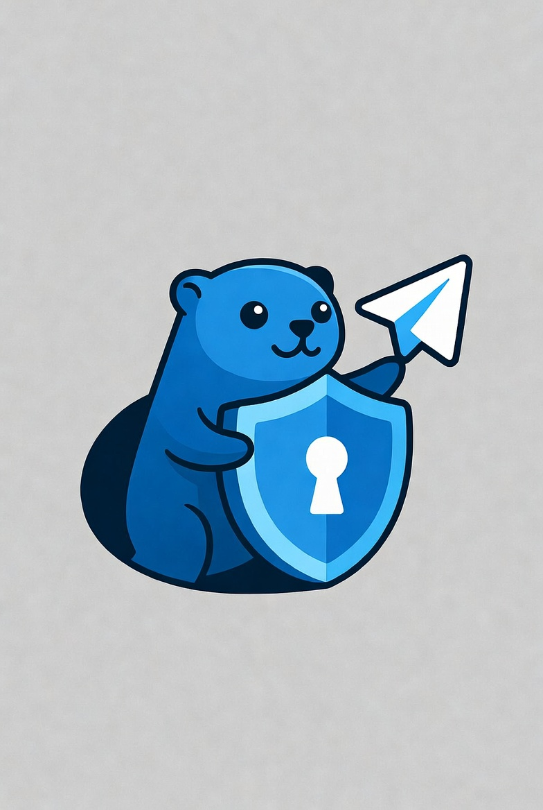

<p align="center">
  
</p>

<h1 align="center">TeleGO</h1>

<p align="center">
  <strong>Высокопроизводительный Telegram MTProxy на Go с TLS-маскировкой, Telegram Middle-End и нативным WEB-протоколом</strong>
</p>

<p align="center">
  <a href="README.md">English</a> •
  <a href="#возможности">Возможности</a> •
  <a href="#быстрый-старт">Быстрый старт</a> •
  <a href="#конфигурация">Конфигурация</a> •
  <a href="#telegram-middle-end">Middle-End</a> •
  <a href="#нативный-web-прокси-telegram">WEB-прокси</a> •
  <a href="#docker">Docker</a>
</p>

---

> **Telegram заблокирован?** TLS-маскировка TeleGO делает ваш прокси неотличимым от обычного HTTPS-трафика для цензоров. [Настройка за 2 минуты](#быстрый-старт)

---

## Почему TeleGO?

| Функция | TeleGO | mtg | Официальный MTProxy |
|---------|:------:|:---:|:-------------------:|
| TLS-маскировка | Да | Да | Нет |
| Защита от проб | Да | Да | Нет |
| Метрики по пользователям | Да | Нет | Нет |
| Лимит IP на пользователя | Да | Нет | Нет |
| Умная блокировка IP | Да | Нет | Нет |
| Защита от OOM | Да | Нет | Нет |
| Горячая перезагрузка | Да | Да | Нет |
| Telegram Middle-End | Да | Нет | Да |
| Нативный WEB-протокол | Да | Нет | Нет |
| Поддерживается (2026) | Да | Частично | Нет |

---

## Возможности

### Сеть
- **Event-driven I/O** — на базе [gnet](https://github.com/panjf2000/gnet) с epoll/kqueue
- **Telegram Middle-End** — маршрутизация MTProxy- и WEB-потоков через постоянные пулы gnet-соединений с ME
- **Нативный WEB-прокси** — HTTPS- или WebSocket-транспорт для Telegram Desktop за Nginx
- **Zero-copy** — прямая работа с буферами без копирования
- **Пул буферов** — отсутствие аллокаций в горячих путях
- **Оптимизированный TCP** — `TCP_NODELAY`, `TCP_QUICKACK`, буферы 64KB

### Безопасность
- **TLS-маскировка** — получает реальные сертификаты от маскирующего хоста
- **Защита от проб** — нераспознанные клиенты перенаправляются на маскирующий хост
- **Защита от replay-атак** — 64-шардовый LRU-кэш с TTL
- **Обнуление ключей** — чувствительные данные обнуляются при закрытии соединения
- **Динамический размер записей (DRS)** — исходящие TLS ApplicationData начинаются с записей по 1369 байт и наращиваются до полного размера после 8 записей или 128 КБ, имитируя поведение Chrome/Firefox
- **Split-TLS** — первая исходящая запись ApplicationData отправляется размером 1 байт, чтобы обойти пассивные сигнатуры по первой записи

### Эксплуатация
- **Мульти-пользователь** — именованные секреты с отслеживанием по пользователям
- **Восстановление ME-соединений** — замена отказавшего физического соединения без переноса исправных привязок
- **Обновление свободных ME-соединений** — подготовка замены до закрытия текущего соединения, ограничение числа кандидатов и счётчики доступности по DC
- **Лимиты подключений** — ограничение IP на пользователя с умной блокировкой
- **Prometheus-метрики** — статистика подключений и трафика по пользователям
- **Горячая перезагрузка** — SIGHUP и отслеживание изменений файла конфигурации
- **SOCKS5 upstream** — маршрутизация через SOCKS5 (Hysteria2, VLESS и др.)

---

## Быстрый старт

**1. Сгенерируйте секрет:**

```bash
telego generate www.google.com
# secret=0123456789abcdef0123456789abcdef  <- в конфиг
# link=tg://proxy?server=...               <- ссылка для клиентов
```

**2. Создайте `config.toml`:**

```toml
[general]
bind-to = "0.0.0.0:443"

[secrets]
alice = "0123456789abcdef0123456789abcdef"

[tls-fronting]
mask-host = "www.google.com"
```

**3. Запустите:**

```bash
telego run -c config.toml -l
```

Флаг `-l` выводит ссылки для Telegram с автоопределением публичного IP.

---

## Telegram Middle-End

Telegram Middle-End (ME) — официальный транспорт Telegram для MTProxy-серверов. Telego направляет через ME авторизованные MTProxy- и нативные WEB-потоки.

Публичный сервер и клиент ME работают на gnet. Telego поддерживает по четыре физических соединения с каждым DC из подписанных артефактов Telegram.

Каждый запрос ME использует публичный исходящий IP выбранного соединения. Это поддерживает SOCKS5 и серверы с несколькими публичными IP.

Регистрация прокси в Telegram и `proxy-tag` не обязательны. Без тега Telego отправляет запросы ME без тега, и транспорт продолжает работать.

ME отключён по умолчанию, потому что он меняет исходящую сетевую схему и резервирует постоянные соединения и ограниченные очереди. Обновление Telego не включает эти требования автоматически.

Перед включением ME разрешите HTTPS-доступ к `core.telegram.org` и TCP-доступ к подписанным конечным точкам ME. Приватным прямым сокетам также нужен UDP-доступ к STUN или правильный `nat-ip`. NAT для прямых соединений должен сохранять исходящие TCP-порты.

Добавьте раздел:

```toml
[middle-end]
enabled = true
# proxy-tag = "0123456789abcdef0123456789abcdef" # Необязательный тег от Telegram
# socks5 = "127.0.0.1:1080"
# nat-ip = "YOUR_PUBLIC_IP" # Обычно не требуется: STUN поддерживает Docker bridge.
```

После изменения этого раздела перезапустите Telego. Если раздел отсутствует или `enabled = false`, ME отключён.

Telego заменяет отказавшее физическое соединение отдельно. Исправные привязки и пулы других DC продолжают работать.

Пока ME не готов, новые подключения используют прямой маршрут к DC. Выбранный маршрут не меняется до закрытия клиентского подключения.

Подробности: [руководство по Middle-End](docs/middle-end.md).

---

## Нативный WEB-прокси Telegram

Telego поддерживает нативный WEB-протокол Telegram Desktop. Приватный HTTP/1.1-сервер на gnet работает за Nginx с настоящим TLS-сертификатом.

Добавьте раздел:

```toml
[web-proxy]
enabled = true
hostname = "proxy.example.com"
carrier = "https-lanes"
bind-to = "127.0.0.1:8080"
trusted-proxy-cidrs = ["127.0.0.1/32"]
```

По умолчанию WEB-потоки передают данные в общее ядро MTProxy на gnet. Внутреннее TCP- или Unix-соединение не создаётся.

Явный параметр `backend` сохраняет совместимый путь через локальный сокет с заголовком PROXY и внутренним токеном. Nginx по-прежнему завершает настоящий TLS.

WEB-потоки используют ME, если активное поколение ME принимает новые привязки. При недоступности ME сохраняется прямой маршрут к DC.

Telegram Desktop управляет WEB-транспортом сам. Пользователю не нужно открывать или держать вкладку браузера.

Полная конфигурация Nginx и доступные транспорты описаны в [руководстве по WEB-прокси](docs/web-proxy.md).

Управляемый установщик по умолчанию размещает MTProxy и WEB на порту 443. Параметр `--mtproxy-port 9443` переносит только MTProxy на порт 9443.

WEB-прокси при этом продолжает работать на `proxy.example.com:443`.

Параметр `--no-web` устанавливает MTProxy без WEB-прокси. Nginx продолжает обслуживать сертификат и обычный сайт для защиты от проб.

---

## Конфигурация

```toml
[general]
bind-to = "0.0.0.0:443"
log-level = "info"

# Защита от абьюза
max-connections-per-ip = 100  # Макс. подключений с одного IP (включая неавторизованные)
max-ips-per-user = 3          # Макс. IP на один секрет
ip-block-timeout = "5m"       # Время блокировки IP
# handshake-timeout = "5s"    # Таймаут хэндшейка (по умолчанию 5с)

[secrets]
user1 = "0123456789abcdef0123456789abcdef"
user2 = "fedcba9876543210fedcba9876543210"

[tls-fronting]
mask-host = "www.google.com"
# splice-host = "127.0.0.1"   # Куда перенаправлять нераспознанных клиентов
# splice-port = 8080
# splice-idle-timeout = "30s" # Таймаут бездействия для splice-соединений (по умолчанию 30с)

# Anti-DPI шейпинг записей (направление proxy -> client)
# enable-drs = true        # Сначала маленькие записи, потом полный размер (1369 -> 16384 байт после 8 записей или 128 КБ)
# enable-split-tls = true  # Первая запись ApplicationData размером 1 байт

[web-proxy]
enabled = false
# hostname = "proxy.example.com"
# carrier = "https-lanes"
# bind-to = "127.0.0.1:8080"
# backend = "127.0.0.1:443" # Совместимый путь через локальный сокет
# trusted-proxy-cidrs = ["127.0.0.1/32"]

[middle-end]
enabled = false
# proxy-tag = "0123456789abcdef0123456789abcdef" # Необязательный тег от Telegram
# socks5 = "127.0.0.1:1080"
# nat-ip = "YOUR_PUBLIC_IP"
# max-connections = 0
# queue-budget-mb = 0

[performance]
prefer-ip = "prefer-ipv4"
idle-timeout = "5m"

[upstream]
# socks5 = "127.0.0.1:1080"   # Прямой DC- или ME-трафик через SOCKS5

[metrics]
bind-to = "127.0.0.1:9090"
```

---

## Docker

```bash
docker run -d \
  --name telego \
  -p 443:443 \
  -v /path/to/config.toml:/config.toml \
  scratchnet/telego:latest
```

### Docker Compose

```yaml
version: '3.8'
services:
  telego:
    image: scratchnet/telego:latest
    restart: unless-stopped
    ports:
      - "443:443"
    volumes:
      - ./config.toml:/config.toml:ro
```

---

## Установка

### Из исходников

```bash
git clone https://github.com/Scratch-net/telego.git
cd telego
make build
```

### Готовые бинарники

Скачайте с [Releases](https://github.com/Scratch-net/telego/releases/latest).

### Go Install

```bash
go install github.com/scratch-net/telego/cmd/telego@latest
```

---

## Метрики

| Метрика | Тип | Описание |
|---------|-----|----------|
| `telego_connections_active` | Gauge | Активные подключения |
| `telego_ips_active` | Gauge | IP с активными подключениями |
| `telego_ips_tracked` | Gauge | Уникальные IP в LRU кэше |
| `telego_ips_blocked` | Gauge | Заблокированные IP |
| `telego_blocked_total` | Counter | Всего блокировок |
| `telego_traffic_in_bytes_total` | Counter | Входящий трафик |
| `telego_traffic_out_bytes_total` | Counter | Исходящий трафик |
| `telego_middleend_admitting` | Gauge | Готовность ME принимать новые привязки |
| `telego_middleend_links` | Gauge | Физические ME-соединения по DC и состоянию |
| `telego_middleend_slot_failure_total` | Counter | Отказы физических ME-соединений |
| `telego_middleend_slot_failure_affected_bindings_total` | Counter | Привязки, закрытые из-за отказов ME-соединений |
| `telego_middleend_slot_repair_total` | Counter | Результаты замены физических ME-соединений |
| `telego_middleend_frontend_routes_active` | Gauge | Активные маршруты ME и прямого резервного подключения |
| `telego_middleend_frontend_route_commits_total` | Counter | Выбор маршрута ME или прямого резервного подключения |

Метрики подключений, IP, блокировок и трафика имеют лейбл `user`. Диагностические метрики ME используют лейблы из таблицы метрик.

---

## Лицензия

[Apache License 2.0](LICENSE)

---

## Благодарности

- **[mtg](https://github.com/9seconds/mtg)** — оригинальная Go-реализация MTProxy
- **[mtprotoproxy](https://github.com/alexbers/mtprotoproxy)** — Python референсная реализация
- **[telemt](https://github.com/nicksnet/telemt)** — высокопроизводительная Rust-реализация
